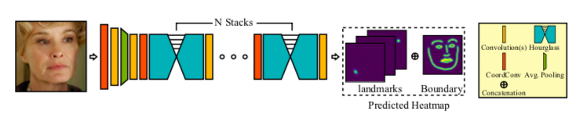
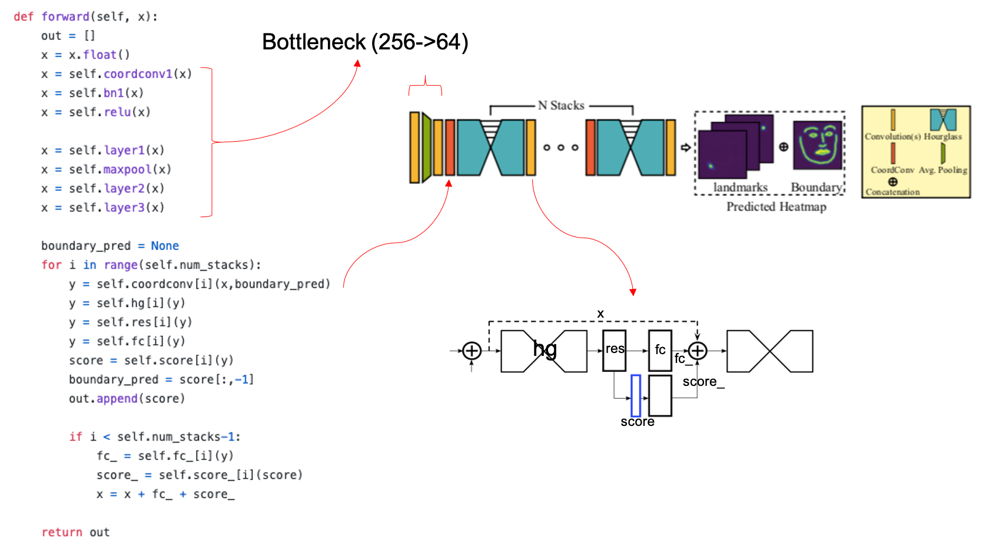

# Adaptive-Wing-Loss-for-Robust-Face-Alignment-via-Heatmap-Regression


❗ongoing repo 


Pytorch implementation of [paper](https://arxiv.org/abs/1904.07399). official implementation can be found at [official](https://github.com/protossw512/AdaptiveWingLoss). 

blog post about the paper(korean) can be found [here](https://medium.com/@ssy10011218/adaptivewingloss-%EB%B0%91%EB%B0%94%EB%8B%A5-%EB%B6%80%ED%84%B0-%EA%B5%AC%ED%98%84%ED%95%B4%EB%B3%B4%EA%B8%B0-d65f495862f). 

<p align="center"></p>


📝 TODO
- [x] prototype
- [ ] evalutaion on 300W + data augmentation
- [ ] performance tuning
- [ ] dependency check
- [ ] provide pretrained weight
- [ ] apply different model (such as DLA, Unet)
- [ ] apply similar loss (such as Focal-loss)
- [ ] apply Integral regression moduel (AWing + Integral)


## Prerequisites
+ Python 3.6 +
+ Pytorch 1.1.0
+ Scipy 0.19.1
+ cv2 3.3.0

## Usage

First, download dataset(Currently 300W supported).

**300W** [link](https://ibug.doc.ic.ac.uk/resources/300-W/)

1. download [part1] ~ [part2]
2. locate 300W images, pts files according to this structure

data
```
|-- 300W
|   |-- 01_Indoor
|   |-- 02_Ourdoor
```


To train a model with downloaded dataset:

    $ python train.py

To test single image result:

    $ python detect.py

## Model overview
<p align="center"></p>

**more detail about model**

<p align="center"></p>

**loss function design**

AWing → (lossMatrix) → Loss_weighted


## evalutaion
evalutaion on 300W testing dataset

evaluation result will soon be updated

| method        |  NME    | FR(10) |
| ------------- |:-------:| :-----:|
| the paper     | 3.07    | X      |
| this repo     | x       | 0.8    |


## Reference
+ [CoordConv](https://github.com/mkocabas/CoordConv-pytorch)
+ [Stacked Hourglass](https://github.com/princeton-vl/pytorch_stacked_hourglass)
+ [AdaptiveWingLoss](https://github.com/protossw512/AdaptiveWingLoss)
